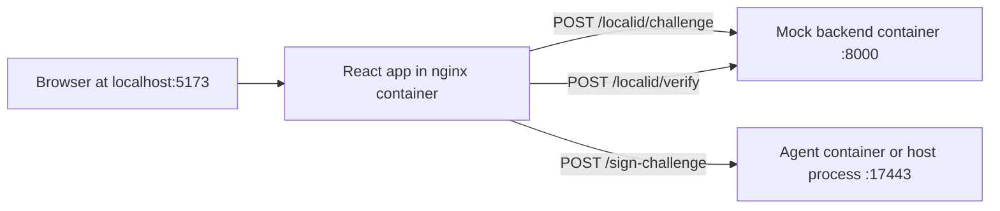

# Docker Demo Stack

Production-like local demo stack for LocalID:

- `frontend` (React static build on nginx, published on `http://localhost:5173`)
- `backend` (Go mock backend on `http://localhost:8000`)
- `agent` (Go signing agent on `http://localhost:17443`)

The browser runs on your host, so the effective browser origin is `http://localhost:5173`. That origin must be present in `security.allowed_origins`.

## Architecture



## Quick start (mock provider, all containerized)

From repo root:

```bash
docker compose --profile demo-mock up --build
```

Or with root script:

```bash
pnpm run docker:demo
```

Then open `http://localhost:5173` and click **Authenticate with LocalID**.

## Run modes

### 1) `demo-mock` (all containerized)

This uses:

- `agent` service with `docker/agent.config.mock.json`
- `providers.default = mock`

Bring it up/down:

```bash
pnpm run docker:up
pnpm run docker:down
```

### 2) `demo-eid` (real card: agent on host, frontend+backend in Docker)

Use this mode on macOS/Windows and as the safest cross-platform option.

1. Start host agent with hardware-ready config (`pkcs11` or `belgian_eid`):

```bash
cd services/agent
go run ./cmd/localid-agent --config ../../docker/agent.config.pkcs11.json
# or:
# go run ./cmd/localid-agent --config ../../docker/agent.config.eid.json
```

2. Start only frontend+backend containers:

```bash
docker compose up --build backend frontend
```

Or:

```bash
pnpm run docker:up:host-agent
```

The frontend defaults to `FRONTEND_AGENT_URL=http://localhost:17443`, so browser traffic still targets the host agent.

### 3) `demo-eid-container` (Linux passthrough attempt, Belgian eID config)

Linux-only best effort for USB smartcard reader passthrough:

```bash
docker compose --profile demo-eid-container up --build backend frontend agent-eid
```

Or:

```bash
pnpm run docker:up:eid-container
```

Optional environment overrides:

```bash
LOCALID_PKCS11_PIN=1234 pnpm run docker:up:eid-container
# and/or force a specific Belgian eID PKCS#11 module:
LOCALID_BEID_PKCS11_MODULE=/usr/lib/libbeidpkcs11.so pnpm run docker:up:eid-container
```

This profile mounts:

- `/var/run/pcscd/pcscd.comm` (PC/SC daemon socket)
- `/dev/bus/usb` (USB bus)

and runs `agent-eid` with `docker/agent.config.eid.json`.

Do not run `agent`, `agent-eid`, and `agent-pkcs11` together (port `17443` conflict).

### 4) `demo-pkcs11-container` (Linux passthrough attempt, generic PKCS#11 config)

```bash
docker compose --profile demo-pkcs11-container up --build backend frontend agent-pkcs11
```

Or:

```bash
pnpm run docker:up:pkcs11-container
```

This uses `docker/agent.config.pkcs11.json` with the same USB + PC/SC passthrough strategy as `agent-eid`.

## Frontend runtime config

Frontend image supports runtime environment configuration without rebuild:

- `FRONTEND_AGENT_URL` (default: `http://localhost:17443`)
- `FRONTEND_BACKEND_URL` (default: `http://localhost:8000`)

Example:

```bash
FRONTEND_AGENT_URL=http://localhost:17443 FRONTEND_BACKEND_URL=http://localhost:8000 docker compose up --build frontend backend
```

## Agent config files

- `docker/agent.config.mock.json` for mock demos
- `docker/agent.config.eid.json` for Belgian eID provider
- `docker/agent.config.pkcs11.json` for generic PKCS#11 provider

Each config is pre-set with:

- `server.host = 0.0.0.0` and `allow_remote_bind = true` (required in containers)
- `security.allowed_origins = ["http://localhost:5173"]`
- `security.allowed_backends = ["http://localhost:8000"]`

If you publish different host ports, update both frontend runtime URLs and these allowlists.

## Belgium eID / PKCS#11 caveats

- `GET /status` now returns `200` even when no card is inserted, with `ready=false` and `cardPresent=false`.
- Set `LOCALID_PKCS11_PIN` when the token prompts for PIN (recommended for container/non-interactive runs).
- Belgian eID module auto-discovery checks common paths (Linux and macOS). Override with `LOCALID_BEID_PKCS11_MODULE` if needed.
- Generic PKCS#11 profile supports `module_path`, `token_label`, and `certificate_label` in config.
- You still need host smartcard middleware, reachable `pcscd`, and a readable PKCS#11 module in the container.

Troubleshooting:

- If `/status` stays `ready=false`, check container logs and validate module path + `pcscd` socket mount.
- If signing fails with PIN errors, export `LOCALID_PKCS11_PIN` before starting compose.
- If module loading fails, pass an explicit module path in config or `LOCALID_BEID_PKCS11_MODULE`.
- If frontend build fails with workspace install errors like `ENOENT ... apps/desktop/node_modules/esbuild`, rebuild the frontend image from current Dockerfiles (`docker compose build --no-cache frontend`). The frontend Docker build is scoped to `examples/react` + `packages/localid-client` and should not install desktop dependencies.
- If Docker reports `input/output error` during `apt`, Go compile, or BuildKit metadata writes, this is usually Docker storage corruption or host disk pressure (not a LocalID code issue):
  - Check free space on host and Docker Desktop disk image.
  - Restart Docker Desktop (or Docker daemon on Linux).
  - Run `docker system prune` (or `docker system prune -a --volumes` if you can remove all unused images/volumes) and retry the build.

OS caveats:

- **macOS:** Docker Desktop does not provide reliable USB smartcard passthrough to Linux containers; prefer host agent mode.
- **Windows:** same practical limitation with Docker Desktop/WSL2 for card readers; prefer host agent mode.
- **Linux:** passthrough may work with privileged container + mounted `pcscd` socket and USB bus, but host permissions and udev rules still apply.

## Useful commands

```bash
docker compose config
docker compose build agent backend frontend
docker compose logs -f agent backend frontend
docker compose down --remove-orphans
```
